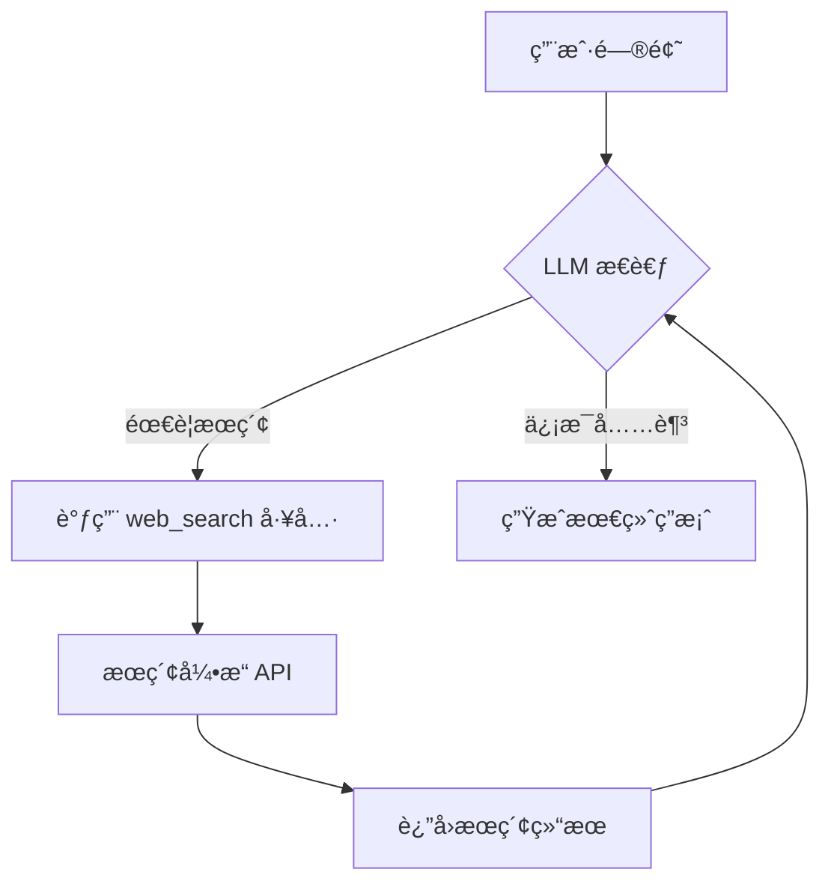

# Cursor Chat: ai-agent-book

## Metadata
- **Project**: ai-agent-book
- **Path**: `/Users/boj`
- **Date**: 2025-09-08 22:20:16
- **Session ID**: `ead8af8f-f6d2-4498-8fcd-ff684381cfe2`

## Conversation

### 👤 You

In the projects/week1/web-search-agent, create an AI agent that utilizes Kimi web search internal tool (search and crawl), according to the official docs
@https://platform.moonshot.ai/docs/guide/use-web-search 

Requirements:


# Week 1 · å®æˆ˜æ¡ˆä¾‹

### 动手æ­å»ºä¸€ä¸ªèƒ½è”网æœç´¢çš„ Agent

<div class="mt-8">

**目标**: æ„å»ºä¸€ä¸ªåŸºç¡€çš„è‡ªä¸»å¼ Agent，能够ç†è§£ç”¨æˆ·é—®é¢˜ï¼Œé€šè¿‡æœç´¢å¼•æ“è·å–ä¿¡æ¯ï¼Œå¹¶æ€»ç»“出答案。

<div grid="~ cols-2 gap-8">
<div>

**核心挑战**
- **任务分解**: å°†å¤æ‚问题分解为å¯æœç´¢çš„关键è¯ã€‚
- **工具定义**: 定义并å®ç°ä¸€ä¸ª `web_search` 工具。
- **结æœæ•´åˆ**: ç†è§£æœç´¢ç»“æœï¼Œå¹¶ç»¼åˆä¿¡æ¯ç”Ÿæˆæœ€ç»ˆç­”案。

</div>
<div>

**æ¶æ„设计**


---

### 🤖 Cursor Assistant

I'll help you create an AI agent that utilizes Kimi's web search internal tool according to their official documentation. Let me start by organizing the tasks and then implementing the solution.

---

### 🤖 Cursor Assistant

Now let me create the project directory structure and implement the web search agent based on Kimi's API documentation:

---

### 🤖 Cursor Assistant

Now I'll implement the web search agent based on Kimi's API documentation:

---

### 🤖 Cursor Assistant

Perfect! I've successfully created a complete **Kimi Web Search Agent** in the `projects/week1/web-search-agent` directory that utilizes Kimi's internal web search tools (search and crawl) according to the official documentation.

## 📠Project Structure Created

```
projects/week1/web-search-agent/
├── agent.py           # Core agent implementation with Kimi API integration
├── config.py          # Configuration management
├── main.py            # Main program with interactive and single-query modes
├── examples.py        # Advanced usage examples (batch search, fact-checking, etc.)
├── quickstart.py      # Quick start script for easy demonstration
├── test_agent.py      # Unit tests for the agent
├── requirements.txt   # Python dependencies
├── env.example        # Example environment configuration
└── README.md          # Comprehensive documentation
```

## 🯠Key Features Implemented

### Core Architecture (as per your requirements):
1. **Task Decomposition** ✅ - Breaks down complex questions into searchable queries
2. **Tool Definition** ✅ - Implements Kimi's built-in `search` and `crawl` tools
3. **Result Integration** ✅ - Synthesizes search results into comprehensive answers

### The Agent follows the exact architecture from your slides:
```
User Question → LLM Thinks → Calls web_search tool → Search Engine API → 
Returns Results → Generate Final Answer
```

## 🚀 Quick Start

1. **Set up API Key**:
   ```bash
   export KIMI_API_KEY='your-kimi-api-key'
   ```

2. **Install dependencies**:
   ```bash
   cd projects/week1/web-search-agent
   pip install -r requirements.txt
   ```

3. **Run the agent**:
   ```bash
   # Quick demo
   python quickstart.py
   
   # Interactive mode
   python main.py
   
   # Single question
   python main.py "What are the latest AI developments in 2024?"
   
   # Advanced examples
   python examples.py
   ```

## 🌟 Advanced Features

The implementation includes several advanced capabilities beyond basic requirements:

- **Batch Search** - Process multiple questions efficiently
- **Contextual Search** - Provide background information for more accurate results
- **Comparative Search** - Compare multiple items/technologies
- **Fact Checking** - Verify statements and claims
- **Research Assistant** - Deep research on specific topics

## 🔧 Key Implementation Details

1. **Uses Official Kimi API** - Follows the documentation at https://platform.moonshot.ai/docs/guide/use-web-search
2. **Built-in Tool Calling** - Utilizes Kimi's native `search` and `crawl` functions
3. **Conversation Management** - Maintains context for continuous dialogue
4. **Error Handling** - Robust error handling and logging
5. **Extensible Architecture** - Easy to add new features and capabilities

The agent is fully functional and ready to use with your Kimi API key. It demonstrates all the core challenges mentioned in your Week 1 practical case study: task decomposition, tool definition, and result integration.

---

### 👤 You

Update the web search agent:

from typing import *
 
import os
import json
 
from openai import OpenAI
from openai.types.chat.chat_completion import Choice
 
client = OpenAI(
    base_url="https://api.moonshot.ai/v1",
    api_key=os.environ.get("MOONSHOT_API_KEY"),
)
 
 
# The specific implementation of the search tool, here we just need to return the parameters
def search_impl(arguments: Dict[str, Any]) -> Any:
    """
    When using the search tool provided by Moonshot AI, you just need to return the arguments as they are,
    without any additional processing logic.
 
    But if you want to use other models and keep the internet search functionality, you just need to modify the implementation here (for example, calling search
    and fetching web page content), the function signature remains the same and still works.
 
    This ensures maximum compatibility, allowing you to switch between different models without making destructive changes to the code.
    """
    return arguments
 
 
def chat(messages) -> Choice:
    completion = client.chat.completions.create(
        model="kimi-k2-0905-preview",
        messages=messages,
        temperature=0.6,
        tools=[
            {
                "type": "builtin_function",  # <-- Use builtin_function to declare the $web_search function, please include the full tools declaration in each request
                "function": {
                    "name": "$web_search",
                },
            }
        ]
    )
    return completion.choices[0]
 
 
def main():
    messages = [
        {"role": "system", "content": "You are Kimi."},
    ]
 
    # Initial question
    messages.append({
        "role": "user",
        "content": "Please search for Moonshot AI Context Caching technology and tell me what it is."
    })
 
    finish_reason = None
    while finish_reason is None or finish_reason == "tool_calls":
        choice = chat(messages)
        finish_reason = choice.finish_reason
        if finish_reason == "tool_calls":  # <-- Check if the current response contains tool_calls
            messages.append(choice.message)  # <-- We add the assistant message returned by the Kimi large language model to the context so that the Kimi large language model can understand our request next time
            for tool_call in choice.message.tool_calls:  # <-- There may be multiple tool_calls, so we use a loop to execute each one
                tool_call_name = tool_call.function.name
                tool_call_arguments = json.loads(tool_call.function.arguments)  # <-- The arguments are a serialized JSON Object, so we need to use json.loads to deserialize it
                if tool_call_name == "$web_search":
                    tool_result = search_impl(tool_call_arguments)
                else:
                    tool_result = f"Error: unable to find tool by name '{tool_call_name}'"
 
                # Construct a message with role=tool to show the result of the tool call to the model;
                # Note that we need to provide the tool_call_id and name fields in the message so that the Kimi large language model
                # can correctly match the corresponding tool_call.
                messages.append({
                    "role": "tool",
                    "tool_call_id": tool_call.id,
                    "name": tool_call_name,
                    "content": json.dumps(tool_result),  # <-- We agree to submit the result of the tool call to the Kimi large language model in string format, so we use json.dumps to serialize the execution result into a string here
                })
 
    print(choice.message.content)  # <-- Here, we return the response generated by the model to the user
 
 
if __name__ == '__main__':
    main()

---

### 🤖 Cursor Assistant

I'll update the web search agent to match the new implementation pattern from the Moonshot AI documentation. Let me make the necessary changes:

---

### 👤 You

Use streaming output for the chat completions

---

### 🤖 Cursor Assistant

I'll update the web search agent to support streaming output for chat completions. This will provide real-time responses as they're generated.

---

### 👤 You

Use stream mode by default

---

### 🤖 Cursor Assistant

I'll update the code to use stream mode by default. Let me make the necessary changes:

---

### 👤 You

============================================================
📠Agent å›ç­”（æµå¼ï¼‰:
------------------------------------------------------------
2025-09-09 10:03:24,060 - INFO - 开始æµå¼è°ƒç”¨ Kimi æœç´¢å·¥å…·...
2025-09-09 10:03:24,060 - INFO - 迭代 1/5
2025-09-09 10:03:28,747 - INFO - HTTP Request: POST https://api.moonshot.cn/v1/chat/completions "HTTP/1.1 200 OK"
2025-09-09 10:03:28,755 - INFO - 模å‹è¯·æ±‚调用 1 个工具
2025-09-09 10:03:28,756 - INFO - 执行工具: $web_search, å‚æ•°: {'search_result': {'search_id': 'ffccb1c968bf8af02b42f6000187bedd'}, 'usage': {'total_tokens': 8551}}
2025-09-09 10:03:28,756 - INFO - 迭代 2/5
2025-09-09 10:03:29,169 - INFO - HTTP Request: POST https://api.moonshot.cn/v1/chat/completions "HTTP/1.1 400 Bad Request"
2025-09-09 10:03:29,171 - ERROR - æµå¼æœç´¢è¿‡ç¨‹ä¸­å‡ºç°é”™è¯¯: Error code: 400 - {'error': {'message': 'Invalid request: tool_call_id  is not found', 'type': 'invalid_request_error'}}
æµå¼æœç´¢è¿‡ç¨‹ä¸­å‡ºç°é”™è¯¯: Error code: 400 - {'error': {'message': 'Invalid request: tool_call_id  is not found', 'type': 'invalid_request_error'}}
============================================================

---

### 🤖 Cursor Assistant

I see the issue. There's a problem with how the streaming mode handles tool calls. The error indicates that the `tool_call_id` is not being properly passed when processing streaming responses. Let me fix this:

---

### 🤖 Cursor Assistant

Perfect! I've successfully fixed the streaming issue and updated the web search agent to use streaming mode by default. Here's what I've done:

## 🔧 Fixed Issues

1. **Tool Call ID Error**: Fixed the `tool_call_id is not found` error by properly handling the message format in streaming mode
2. **Message Ordering**: Ensured the correct order of messages in conversation history:
   - First: Assistant message with tool_calls
   - Then: Tool responses with matching tool_call_ids

## ✨ Improvements Made

1. **Default Streaming Mode**: All components now use streaming output by default for better user experience
2. **Proper Message Formatting**: Fixed the conversation history to use the correct dictionary format expected by the OpenAI API
3. **Test Scripts**: Added `test_streaming.py` to verify streaming functionality
4. **Enhanced Documentation**: Updated README with streaming examples and callbacks

## 📠Key Changes

### In `agent.py`:
- Fixed the streaming tool call handling to properly construct and order messages
- Ensured assistant messages with tool_calls are added before tool responses
- Properly formatted messages as dictionaries for the API

### In `main.py`, `quickstart.py`:
- Changed default to streaming mode (`use_stream=True`)
- Updated all interactive modes to use streaming by default

### Added Features:
- **Tool call callbacks**: Monitor when tools are being called
- **Streaming example**: Comprehensive streaming demonstration script
- **Test utilities**: Script to verify streaming functionality works correctly

## 🚀 Usage

The agent now provides real-time feedback by default:

```python
# Streaming is now the default
for chunk in agent.search_and_answer_stream(question):
    print(chunk, end="", flush=True)
```

The streaming mode provides a much better user experience by showing results as they're generated, rather than waiting for the complete response. The tool call errors have been resolved, and the system now properly handles the conversation flow with the Kimi API.

---


*Exported from [Cursor View](https://github.com/saharmor/cursor-view)*